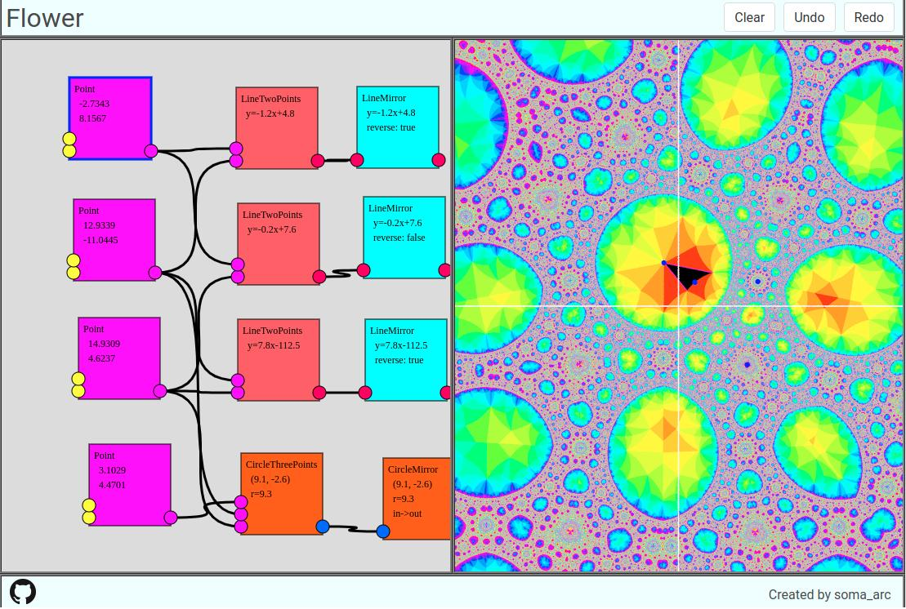

# Flower: A flow-based programming environment for kaleidoscope patterns

Flow-based programming is one of the programming paradigm.  It represents all of the process and data as the graph composed of nodes and edges.

There are many software using Flow-based programming environment. For example, 3D modeling software like blender or maya adopt flow-based programming in order to make textures of objects.
In addition, there are audio visual programming environment such as PureData or TouchDesigner. 
However, there is no mathematical software using flow-based programming environment.

So, I'm developing geometrical software called Flower to generate kaleidoscope patterns based on flow-based programming. The link of the Flower is as follows.
[https://soma-arc.net/Flower](https://soma-arc.net/Flower)
There is an introductory video [https://youtu.be/FWp-eF5gz5o](https://youtu.be/FWp-eF5gz5o)

## Reference

- Kento Nakamura and Kazushi Ahara,
        A Flow-based Programming Environment for Geometrical
        Construction, 
        Mathematical software -- ICMS 2020, Lecture Notes in Computer Science,
        Volume 12097, Springer, 2020, pp. 426--431.

## Usage
There is a [introductory video](https://www.youtube.com/watch?v=FWp-eF5gz5o) on YouTube.

## Author
- soma_arc (Kento Nakamura)

## Copyright
Copyright (c) 2019 - 2020 soma_arc (Kento Nakamura)

## License
Licensed under GPL-3.0
